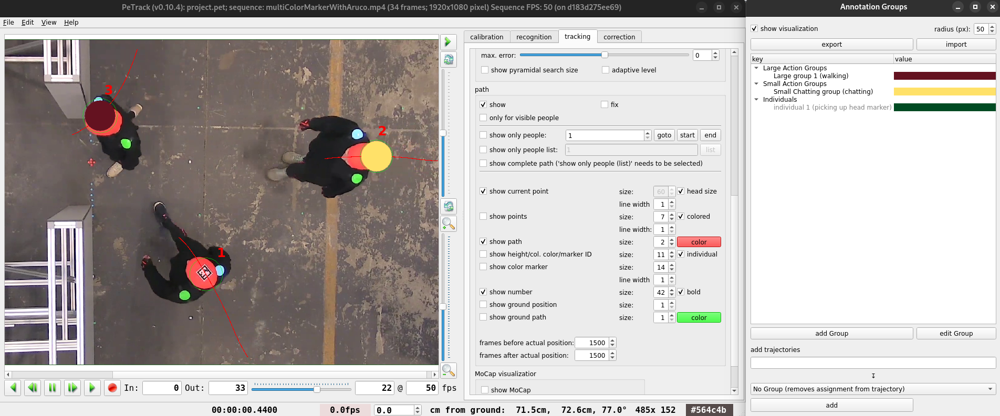
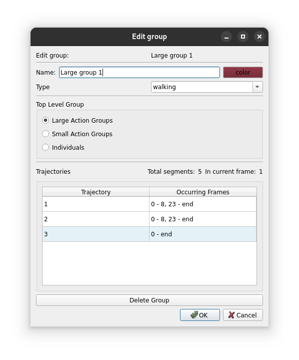

# Annotation Groups

Petrack offers a tool for grouping parts of trajectories into different so-called Annotation Groups.
An Annotation Group is basically just a collection of multiple trajectory parts, that can be colored to be visually
distinct.  
For example, in the beginning of the video, people are just moving around.
During the experiment some people start to chat and later continue to walk around again.
This feature brings the possibility to mark these groups of chatting people.
A trajectory can be part of exactly one group each frame, but the assigned group may change over time (for the given
example: walking from
frame 0 to 10, chatting from 11 to 15 and walking again from 16 until the end).
In addition to just coloring the groups visually, the assignments can also be exported in a `.json`-format for further
analysis (e.g. in python).
This may be useful when analyzing social behaviour.

This page will show an example of how this feature can be used.

For this feature to work properly it is *necessary* that all tracking and correction work has been finished.  
:::{warning}
Changes in trajectory IDs (e.g. by deleting certain trajectories) may lead to issues and incorrect groups!
:::
## Idea and Naming

A *Group* is a collection of trajectories.
It has a name, type and color. Names should be distinct as well as colors.
The types can be used to model that different groups are doing the same thing e.g. multiple smaller groups of people
are 'chatting'. By default, the group type is 'No Type'.

*Trajectory Assignments* always hold from the assignment frame to the next change.
This means, that it is not needed to assign a trajectory to a group for every frame.  
**Example**: Assigning trajectory number 1 to Group 'A' at frame 2 and to Group 'B' at frame 10 yields:

- No assignment for frames 0 and 1,
- Assigned to Group 'A' from 2 to 9, and
- Assigned to Group 'B' from 10 onwards until the end of the video
- Re-assigning it to Group 'C' at frame 2 will change the whole entry i.e. assign to 'C' for all frames 2 - 9

Groups are organized in *Top Level Groups* or *TLGs*.
Top level groups are fixed[^1] to 'Large Action Groups', 'Small Action Groups' and 'Individuals'.
The have the default color recommendations red, yellow and green respectively.

When creating a Group, the values and TLG it belongs to can be set freely.

[^1]: Fixed in a sense that they cannot be changed in petrack itself. By editing a group export file manually you can
change them. (See [exporting and importing group data](#exporting-and-importing-group-data))

### UI

The user interface can be opened from the menu bar. By clicking `view`->`Show Group Annotation Window` a separate window
will open.
This is the main interface of the Annotation Group feature.

Figure 1 shows how the interface looks like when working on groups.
The checkbox at the top toggles the visualization with the corresponding radius on the right.  
The visualization is done by drawing a circle with the color of the assigned group in that frame on top of the
trackpoint.
In the example in frame 22: Trajectory number 1 is not assigned to any group, number 2 to the yellow group 'Small
Chatting group' and number 3 to 'Large group 1'.
Right-clicking a colored Trackpoint also yields the group name if in doubt due to similar coloring.

:::{figure-md} annotation_group_working

Figure 1: Working on group assignments.
:::

Below these options there are button for exporting and importing group data (
see [exporting and importing group data](#exporting-and-importing-group-data)).

The large tree view shows an overview over all groups. Unused groups are greyed out, like 'individual 1' in the TLG '
Individuals'.

Changing Groups can be done by the two buttons below the tree view:

- `add Group` opens a dialog for adding a new group. Here, you can select the name, type, color and top level group.
- `edit Group` opens a similar dialog for a selected group. Not only can the properties of a group be changed, but
  additionally it shows an overview over all assigned trajectories.
  The trajectory number is on the left and the right hand side shows all frames, where this trajectory is assigned to
  this
  group.
  Light blue colored rows indicate an assignment at the current frame.
  In this dialog a Group can also be deleted.

:::{figure-md} editing

Figure 2: Editing a group.
:::

Adding / modifying trajectory assignments works with the fields below.
You can enter trajectories in the textfield as a combination of comma separated Ids or intervals (e.g. 1, 2, 5-8, 9
selects trajectories 1, 2, 5, 6, 7, 8, 9).
In the combobox below you specify the Group you want them to be assigned to. Here, you can also remove assignments by
selecting 'No Group'.
The action will be executed when clicking on the button `add`.

## Exporting and Importing Group Data

You can export and import group data by using the corresponding buttons at the top of the dialog and selecting a file.
The format we use is `.json`, since it is widely used and can be simply imported to python for further analysis of the
data.

The data is organized in:

- `assignments`: containing all trajectory assignments by trajectoryId (visible number minus 1) and a list of
  assignments with the groupId and starting frame.
- `groups`: containing all groups with their values like name, color, type
- `topLevelGroups`: containing the Top Level Group data. *Here you can change the TLG names shown in petrack when
  importing the file*