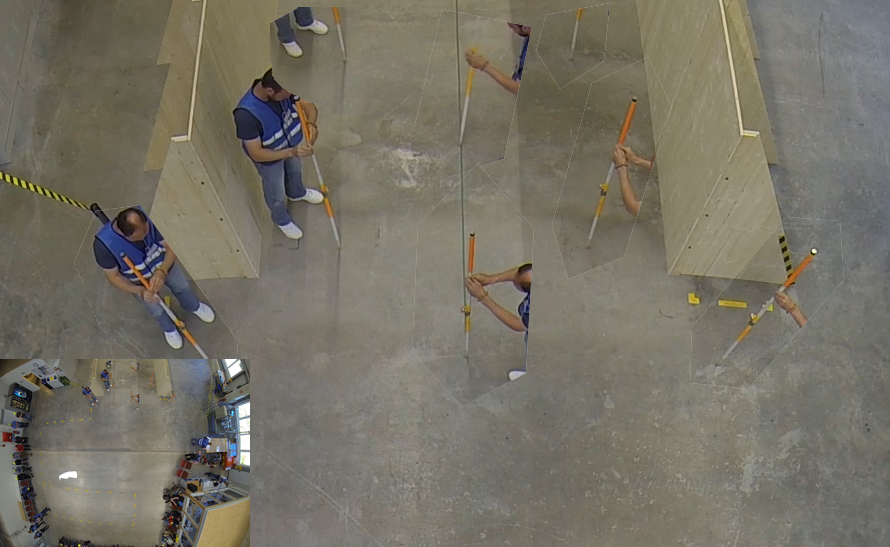
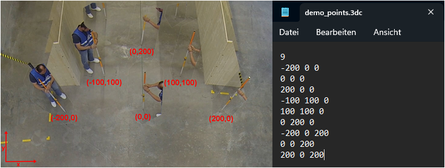
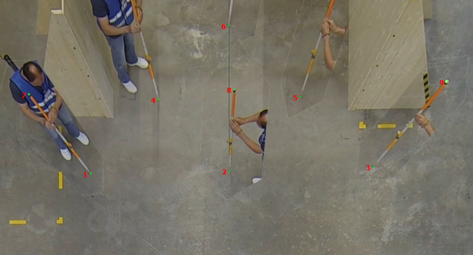

# Extrinsic Calibration

After the intrinsic calibration is done you can move on to the extrinsic calibration.
For this you first need to prepare the coordinate points measured during the experiments and possibly prepare the
corresponding images.

## Image & Point File Preparation

If you decided on a [3D calibration](/planning/calibration.md) where you place e.g. a pole on each point on the ground,
 you need to create one image where all the points are visible at once. For this, it is helpful to combine cutouts of
the processed points inside one image (Figure 1). To create such an image, a free programme as e.g. [Gimp](https://gimp.org) can be helpful.

:::{figure-md} extrinsic_all_enlarged

Figure 1: Enlargement of combined image of all calibration points being processed during the experiments.
:::

Once the combined image has been created you have to write down the coordinates for each point assigned during the experiment.
These coordinates need to be collected in a text editor and saved as a `.3dc` file. It does not matter where the point 
(0,0) is, however, the relations of the point to one another should be represented correctly. 
The first line of the file contains the total number of coordinates points in the file. Starting from the second row, 
all coordinates should be listed in centimeter according to their X, Y and Z coordinates. You can view an example of
our coordinate system and the corresponding points in Figure 2.
 

:::{Note}
The markings in the picture are solely for your orientation - you do not have to recreate this!
 
Since we have chosen to mark a coordinate system on the floor and create a 3D system by holding pole of known length
(200 centimeters) on each point, our Z coordinates are either 0 (floor) or 200 (top of pole).
:::
 

:::{figure-md} extrinsic_grid_and_points
{width=950}

Figure 2: Example of a possible coordinate system and the corresponding point file.
:::

After you have created your point file save it with the file ending `.3dc`. This is the file format that can be loaded
into PeTrack.

## PeTrack Workflow

With the combined image of all coordinate points and the point file created, you can now perform the extrinsic calibration
in PeTrack. For that, open the image of all combined coordinate points (Figure 1) in PeTrack or drag and drop it into the
[tab view](/user_interface/user_interface.md).

::: {Tip}
To avoid shifting the coordinate system while clicking and dragging the mouse in the [video tab](/user_interface/user_interface.md) it is
recommended to check the `fix` checkbox in the `coordinate system` and in the `alignment grid` section
at the bottom of the `calibration tab`.
:::

Now all coordinate points that are listed in the points file need to be selected in the combined image. 
 
You need to select the points **in the same order** as they appear in the points file!
 
You can select the points with `Ctrl + double click left mouse button`. Select the points as accurate as possible
by zooming into the image. In case you are unhappy with the selected point you can unselect it by
`Ctrl + double click right mouse button`.  

:::{Tip}
If the green circles that appear around the chosen points are too large for your taste, go to the `tracking` tab in the
[tab view](/user_interface/user_interface.md) and scroll to the `path` section on the page. Here you can uncheck the `head size` checkbox
to the right of `show current point` and now you are able to enter a smaller value of your own choosing. This value
represents the size of the green circles.
:::

Once you have selected all points in the same order as your points file, your chosen points should look similar to 
the example in Figure 3. 

:::{figure-md} extrinsic_select_points
{width=950}

Figure 3: Example of a selected points on the combined image in PeTrack.
:::

Now you can click on `load` in the `extrinsic parameters` section of the `calibration tab`. Navigate to your `points.3dc`
file and select it. Now click on `fetch` and PeTrack will assign the pixel coordinates of your selected points on the
screen to the real-world coordinates written down in the `points.3dc` file. 
 
You will also note that once you click on fetch your selected points on the screen will disappear.
 
Now you have the option to view the error of your extrinsic calibration by clicking `error`. This will give you an idea 
of e.g. how well you prepared your coordinate system and the accuracy of your point selection in PeTrack. If you are happy
with the results you can click `save` and the pixel coordinates that were matched to the real-world coordinates will also
be saved in the `points.3dc` file.
 
In case you are unhappy with the outcome, you can redo the calibration by selecting new points and loading in the
original `points.3dc` file again.
 

:::{Tip}
You can view the selected and calculated calibration points by checking the `calibration points` checkbox in the `coordinate system`
section. If you notice a points that is particularly bad in alignment with the calibrated value, you can redo the calibration and exclude
this point. This will minimize your error for the extrinsic calibration.
:::

After you are finished with the calibration steps it is recommended that you save the PeTrack project with the current calibration
status (intrinsic & extrinsic calibration). In case something goes wrong during the following steps, you have a project
you can return to and do not have to redo everything from the start.

:::{Tip}
To avoid scrolling through the numbers in the `calibration tab` you can check the `immutable` checkbox on the top right
of all the sections on the page. This can save you a lot of trouble going forward!
:::
