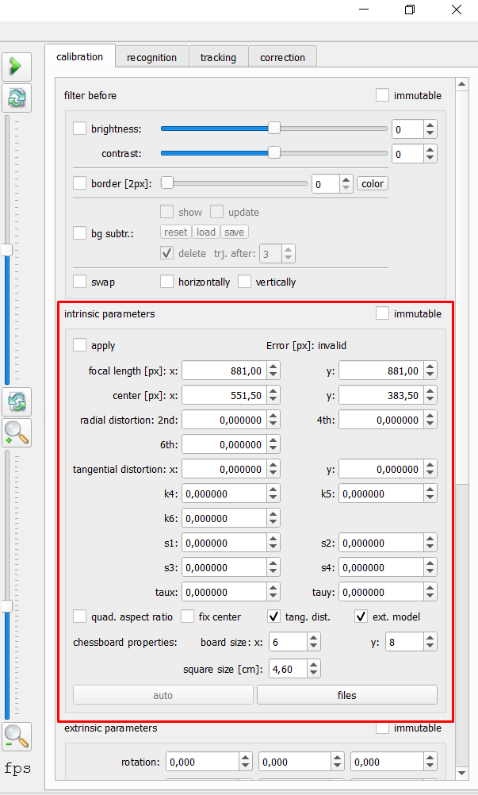

# Intrinsic Calibration

## Image Preparation
During the experiments, a [calibration pattern](/planning/calibration.md) was filmed with the same camera 
settings as used during the experiment. In order to use this pattern for the intrinsic calibration, screenshots
have to be taken out of the video. A free tool as e.g. [Gimp](https://www.gimp.org/) can be used to
take screenshots out of the video with identical pixel dimensions as the video recording.

:::{Important}
Make sure to select images that together fill out the entire area of interest from the video! Keep the images per
side balanced so a particular view is not overrepresented. [More Information...](/planning/calibration.md)
:::

## PeTrack Workflow
After opening PeTrack, the calibration tab will be the opened tab in the [tab view](/user_interface/user_interface.md).
For the intrinsic calibration we will focus on the `intrinsic parameters` section in the middle
of the calibration tab. 

:::{figure-md} intrinsic-calib-section
{width=300px}

Intrinsic calibration section in PeTrack
:::

:::{Tip}
To be able to see the changes that occur or the quality of the calibration, it can be helpful to load e.g.
a video of the experiments into PeTrack. For that, drag a video into the [tab view](/user_interface/user_interface.md)
of PeTrack.
:::
 
To select the images of the intrinsic calibration, click on the `files` button at the bottom of the
`intrinsic parameters` tab. Now select your intrinsic calibration images from your local storage.
After the images have been selected, click on the `auto` button at the bottom of the
`intrinsic calibration` section. By click on the `auto` button, the intrinsic calibration will be started.
During the calculation you might see your calibration images appearing in the video view with a 
colored grid over them.
 
After the calculation is done, your initially selected video will appear back in the video view.
Now select the `apply` checkbox at the top of the `intrinsic parameters` section and you will see the
intrinsic calibration be applied. You can check the quality of the calibration by checking if straight lines in the
original setup are now being displayed straight in PeTrack as well. If you have used a wide-angled lense the fisheye
effect of the lense should be gone as well.

:::{figure-md} pre_post_intrinsic

Pre intrinsic calibration vs. Post intrinsic calibration.
:::

If you are not happy with the outcome of the calibration you can load different images and trigger
a new calculation of the calibration. Make sure that your area of interest in the video is well straightened before moving on.

:::{Important}
Note that you have to finalize your intrinsic calibration before moving on!
 
The extrinsic calibration can only be performed if an intrinsic calibration is loaded and applied!
:::
