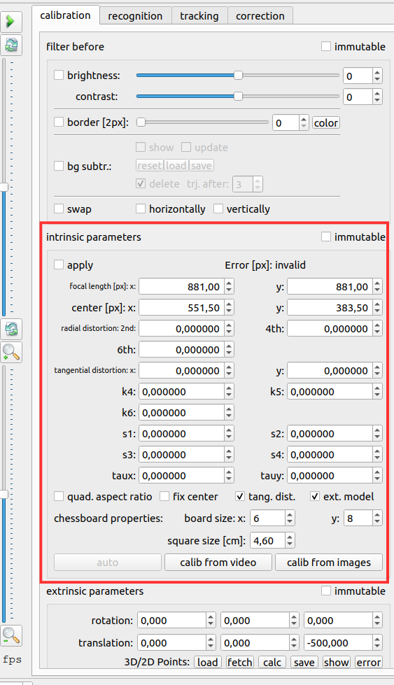
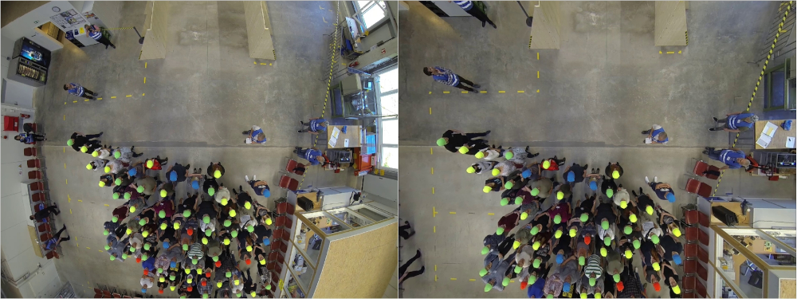

# Intrinsic Calibration

## Image Preparation
During the experiments, a [calibration pattern](/planning/calibration.md) was filmed with the same camera 
settings as used during the experiment. In order to use this pattern for the intrinsic calibration, screenshots
have to be taken out of the video. A free tool as e.g. [Gimp](https://www.gimp.org/) can be used to
take screenshots out of the video with identical pixel dimensions as the video recording.
If you are inexperienced, it is also possible to let PeTrack choose screenshots from your video for the calibration.

:::{Important}
Make sure to select images that together fill out the entire area of interest from the video! Keep the images per
side balanced so a particular view is not overrepresented. [More Information...](/planning/calibration.md)
:::

## PeTrack Workflow
After opening PeTrack, select the calibration tab in the [tab view](/user_interface/user_interface.md).
For the intrinsic calibration we will focus on the `intrinsic parameters` section in the middle
of the calibration tab. 

:::{figure-md} intrinsic-calib-section
{width=300px}

Intrinsic calibration section in PeTrack
:::

:::{Tip}
To be able to see the changes that occur or the quality of the calibration, it can be helpful to load e.g.
a video of the experiments into PeTrack. For that, drag a video into the [tab view](/user_interface/user_interface.md)
of PeTrack.
:::

To select the images of the intrinsic calibration, click on the `calib from images` button at the bottom of the
`intrinsic parameters` section. Now select your intrinsic calibration images from your local storage.
If you only have a video and no screenshots of your calibration, click on the `calib from video` button next 
to the `calib from images` button. After selecting the video first, you are prompted to choose a directory to save
the generated screenshots of your calibration. A popup including a progress bar shows up, indicating how far the 
generation process is from finishing and how many good samples were found in the video.
After the images have been selected/generated, click on the `auto` button at the bottom of the
`intrinsic calibration` section. By clicking on the `auto` button, the intrinsic calibration will be started.
During the calculation you might see your calibration images appearing in the video view with a 
colored grid over them.

After the calculation is done, your initially selected video will appear back in the video view.
Now select the `apply` checkbox at the top of the `intrinsic parameters` section and you will see the
intrinsic calibration be applied. You can check the quality of the calibration by checking if straight lines in the
original setup are now being displayed straight in PeTrack as well. If you have used a wide-angled lense the fisheye
effect of the lense should be gone as well.

:::{figure-md} pre_post_intrinsic

Pre intrinsic calibration vs. Post intrinsic calibration.
:::

If you are not happy with the outcome of the calibration you can load different images and trigger
a new calculation of the calibration. Make sure that your area of interest in the video is well straightened before moving on.
Note that you lose parts of your image in the post-intrinsic image. If you lost too much, you can try to use the `border` in the `filter before` box. This will enlarge your image and give you back some lost parts. Take care that the enlarged image will have a higher calibration error in the outer parts!

:::{Important}
Note that you have to finalize your intrinsic calibration before moving on!  
The extrinsic calibration can only be performed if an intrinsic calibration is loaded and applied!
:::

With the help of the `alignment grid` at the end of the calibration tab you can check whether straight lines in the real world are also straight lines in the image. Note that the alignment grid will only have the real dimension once the extrinsic calibration is done.