# Getting Started 

This page goes through an exemplary project. You can download this example project [here](https://go.fzj.de/petrack-demo-download).

## Experimental Setup

### Prepare cameras

- Charge batteries or use an external power supply
- Ensure
- Intrinsic calibration
  - chess-board snapshots from different angles and chessboard object being located on different parts of the picture (left, right border, ...)
  - snapshots must be from a video with identical settings (resolution, fov) as the videos taken in the experiment.
  - auto focus (AF) set to manual

### Setup cameras

- Check the view and secure camera (must not move/slide, must not fall down on participants).
- In a multi camera setup, the footage needs to be synchronized in time (clap for acoustic synchronization, visual synchronization also possible).
- Find multiple points in the real work, that you link to your virtual world coordinate system.
- In case the camera view is changed, the extrinsic calibration needs to be re-done.
- The extrinsic Calibration is needed to map pixel coordinates to the virtual world coordinate system. To be able to calculate the object’s position in the real-world coordinate system, the object seen in the video frame needs a height-information. If you have the triple (height, pixelx , pixely), `PeTrack` will calculate the triple (x,y,z) of the object in the virtual world coordinate system as defined in the extrinsic calibration process. The calibration needs at least 4 points, which must not be within just one plane. It will not suffice to use markers on the floor.

We have made good experiences with the practice to measure and mark points on the floor and use these points and a surveyor’s staff (measuring rod) to create known points in 3d space. the surveyor’s staff must have some means to find the orientation orthogonal to the ground plane (in other words: staff aligned with gravity). The surveyor’s staff can be seen below: 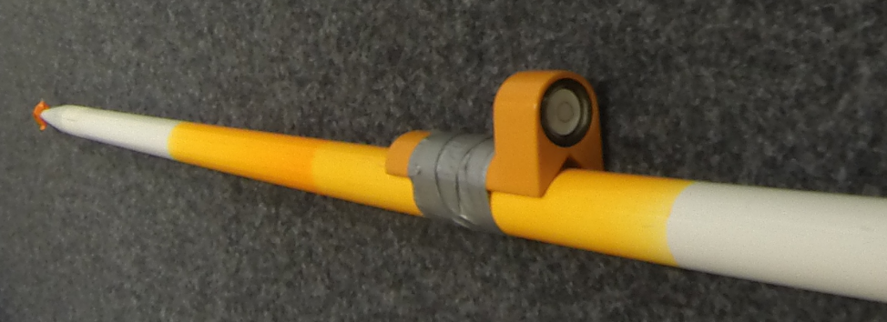

Additional helpers to define the positions of the calibration points: 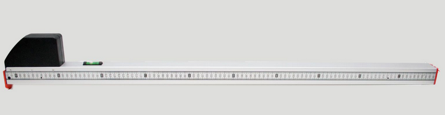

For additional help, check out our detailed documentation on calibration in the "Planning of Experiments" section: [](planning/calibration.md)

### After the experiments

- Save the raw video footage.
- Extract the various runs in separate video files (mp4) (e.g., Adobe Premiere Pro CC).
- While handling the video data in premiere, synchronize them using the audio track (clapping) or the video (unique movement/event) in the timeline. This will ensure, that trajectories from different cameras can be merged.

## Using PeTrack

The usage and some settings will be explained with the provided demo project ('demo' folder) , the folder contains all necessary files to set up a PeTrack project. You can download this example project [here](https://go.fzj.de/petrack-demo-download). <!--Make sure also to read our [best practices guide](usage/Best-Practices).-->

### Calibration

The first step to setup a PeTrack project is the calibration of the camera, which mainly consists of two parts [intrinsic](intrinsic_calib) and [extrinsic](extr_calib) calibration. Additionally some color correction and the addition of borders can be set up here.

(intrinsic_calib)=
#### Intrinsic calibration

1. open PeTrack without any arguments, the program should automatically open in the calibration tab.

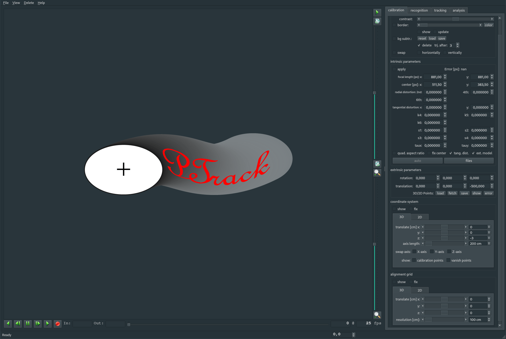

2. click on “files” and browse to the snapshots out of the video for intrinsic calibration (chessboard), select ALL of those snapshots (for multi-selection hold `⌃ Ctrl/⌘ Cmd` and sequentially click on the files). The snapshots for the demo are located in: `demo/00_files/calibration/intrinsic`.

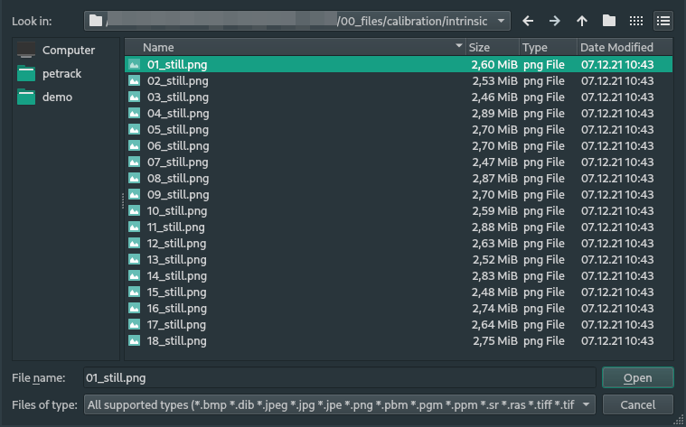

3. click on “auto” to start intrinsic calibration

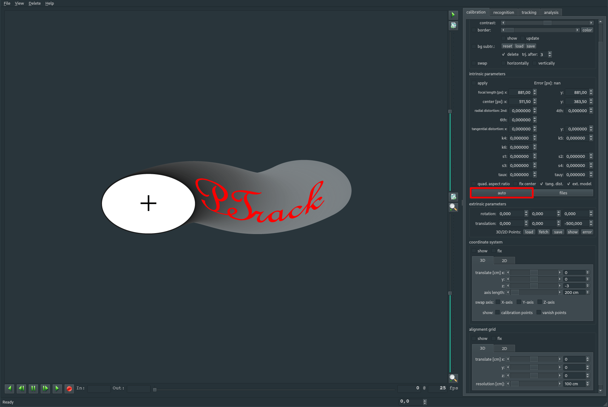

4. see how the parameters in the `intrinsic calibration` pane have changed

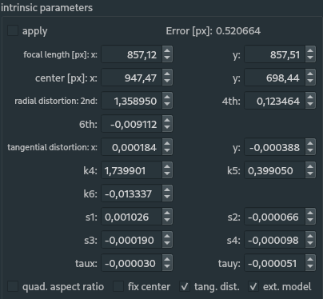

5. check “apply” and save the project file under a name corresponding to the camera and the resolution/FOV settings and “\_intrinsic_calibration”.

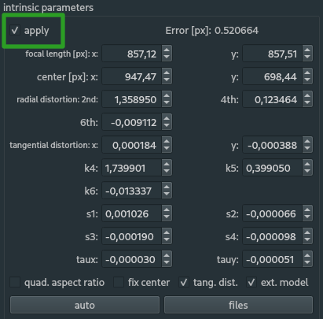

This project can be reused for other videos using the same camera+settings. (Alternatively you can re-do the intrinsic calibration in all other projects using the same camera. Intrinsic calibration will invalidate all recognition/tracking data.)

_`demo/01_calibration/01_intrinsic.pet` is the resulting PeTrack project files after these steps._

(extr_calib)=
#### Extrinsic Calibration

To reuse the extrinsic calibration for multiple videos, taken from the same camera in the same view, `PeTrack` will store the data in a external file (\*.3dc). If this file is not created yet, a template needs to be prepared in the following format: first line only consists of the integer a “amount of points”, followed by a lines with the coordinates (in cm) of the virtual world coordinate system. A sample is seen below with 16 points:

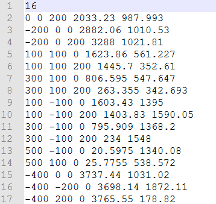

1. Create an image with all the marked points, that you want to use. We therefore took snapshots out of the video with all the points and merged the pictures into one image. It is very important, that the pixel-coordinates from each point will remain the same in the original snapshot and the image, you copy it to.

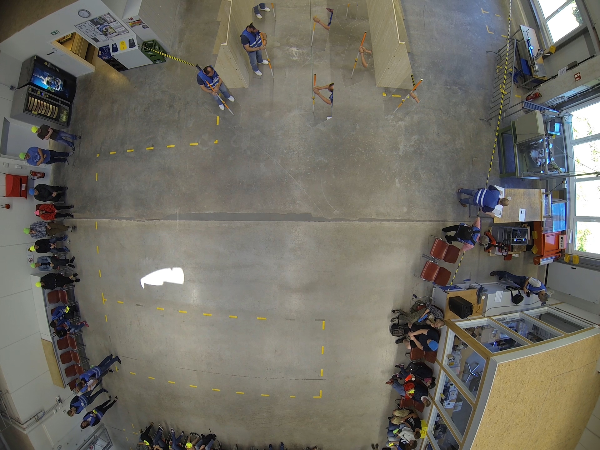

2. Open `PeTrack`. Make sure, the intrinsic calibration is loaded or re-done and that `apply` is checked.

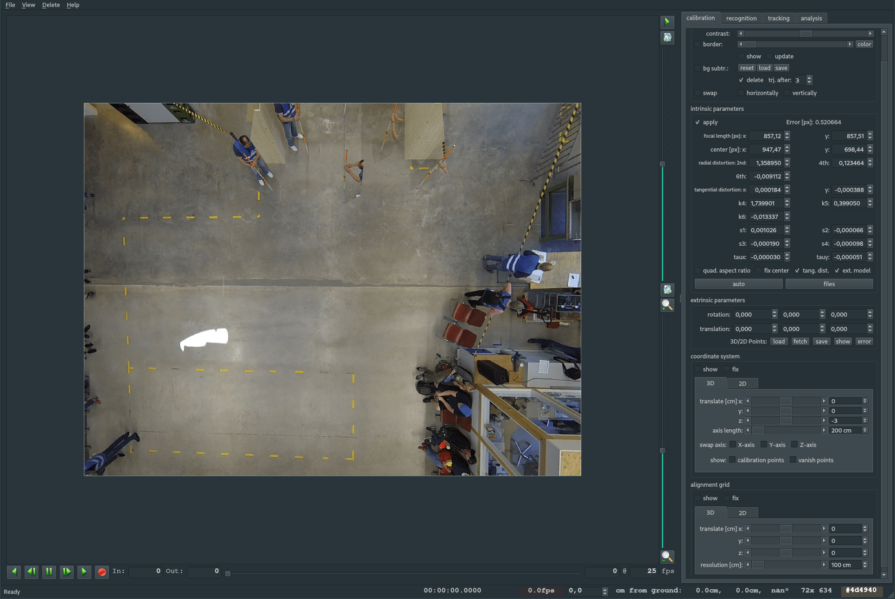

3. Open the image and mark the special points **in the order, they appear in the file** (\*.3dc). (The points can also be marked sequentially by playing a video, which shows these marker points.) Markers can be set with `⌃ Ctrl/⌘ Cmd` + a double left klick and deleted with `⌃ Ctrl/⌘ Cmd` + a double right click.

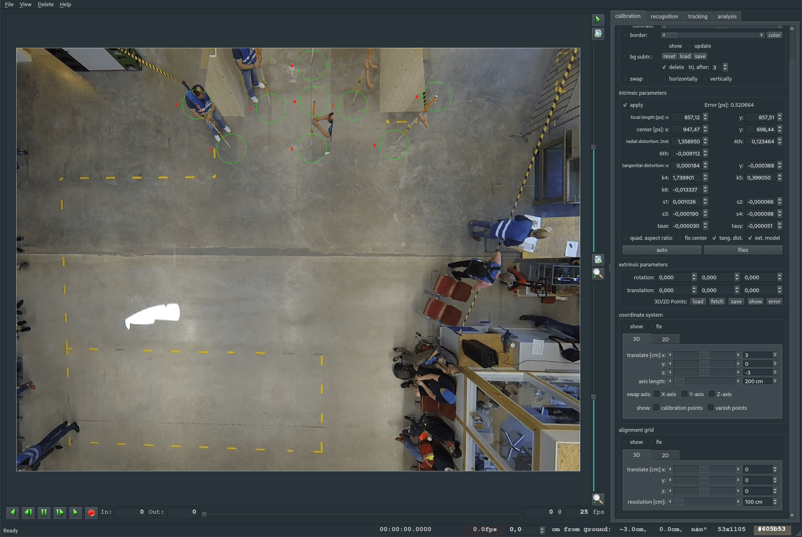

4. Load the points from the \*.3dc file by pressing load and browsing to the file. Make sure no additional spaces are at the end of each coordinate line in your \*.3dc document. `PeTrack` won’t be able to read these coordinates and show you an error message that the 2D points that you have selected in the picture don’t match the number of 3D points in you \*.3dc document!

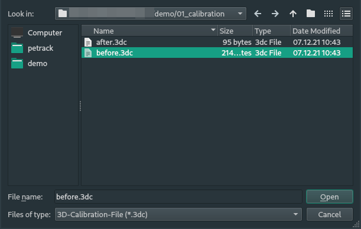

5. Click “fetch” and then “save” to make `PeTrack` complete the \*.3dc file. It will now hold the pixel coordinates of each point in the corresponding line. (see above)

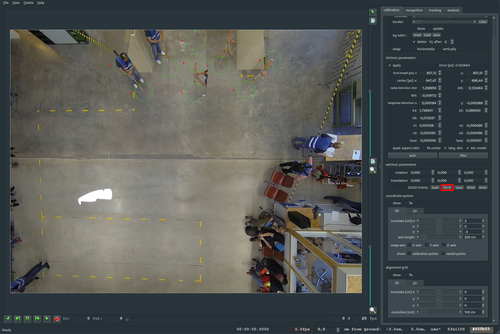

6. You can verify the result with the buttons “show” and “error”. Additionally, you can have `PeTrack` draw the virtual world coordinate system by clicking on the “show” checkbox in the “coordinate system” section and adjust the settings in the 3D tab. Move the coordinate system around and verify plausibility.

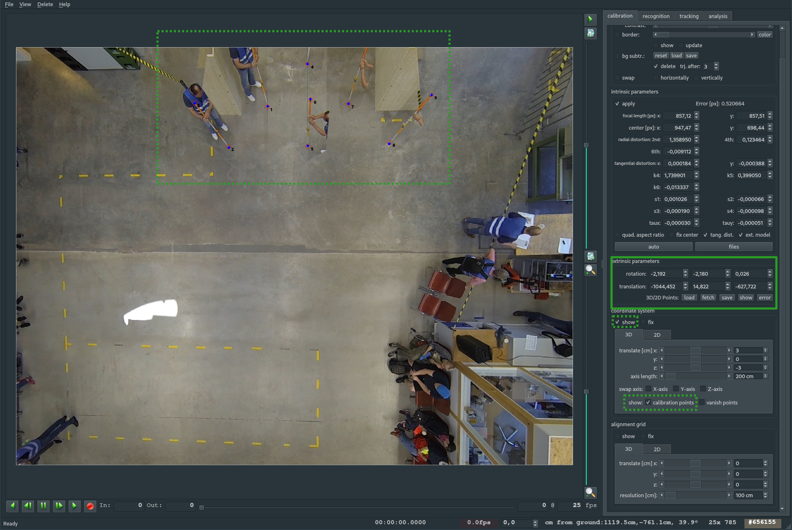

_`demo/01_calibration/02_extrinsic.pet` is the resulting PeTrack project files after these steps._ As we want to extract the trajectory usually from videos, the can be added via double-clicking on the image or by `File/Open Sequence`.

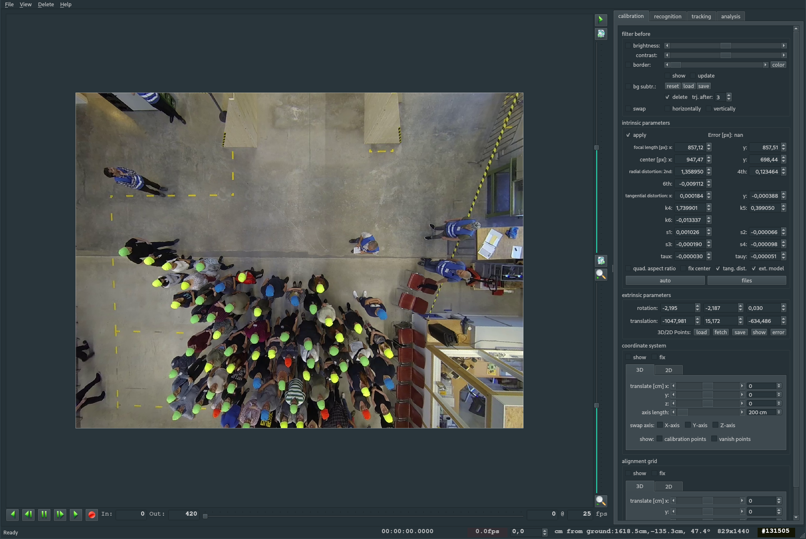

_`demo/01_calibration/03_calibrated_with_video.pet` is the resulting PeTrack project files after these steps._

### Recognition

After the calibration is done, the next step is to set up the recognition. Switch to the tab “Recognition” and check “show”. Press (`⌃ Ctrl/⌘ Cmd` + `1`) to adjust view. (Alternatively, you can use the menu-bar, View > Fit in region of interest)

#### Setting ROI (region of interest) for recognition

Click on `show` in the `region of interest` pane. You will notice small green lines on the edge of the image. Only if the `fix` box is unchecked, it is possible to adjust the borders of this region. Mouse over any image-edge (top, bottom, left, right) and click and drag the green line to fit your needs. Notice, how the cursor changes from “hand” to “window-resize”, when you approach the current ROI edge. This is the area in which PeTrack will try to detect the pedestrians.

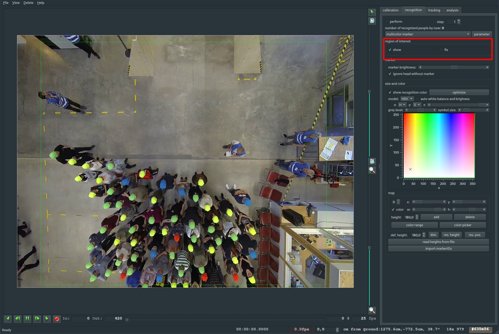

#### Setting the marker parameters

The setup for the marker will only be shown exemplary for a multicolor-marker. For multicolor setups it is recommended to use different colors depending on the height of the participants. Each color will be later mapped to one height. In the demo the following color were used:

| color  | height/cm |
| ------ | --------- |
| purple | 146       |
| orange | 158       |
| yellow | 168       |
| green  | 179       |
| blue   | 192       |

1. Select the wanted marker, in most case the multicolor marker should be chosen, even if only one color hats are used.
2. After selecting the marker type, click on `parameter` to set up the marker. 
3. Select the desired parameters. `open radius` and `close radius` should be deactivated when selecting colors, as the image mask does not accurately depict the selected color. To see which color range currently is detected, select `mask`.


4. In the `map` pane the different markers are maintained. For each group you have in your video, repeat the following steps:

   4\.1 Clicking on `color range` opens a dialog where you can choose the range of colors for the currently selected group. 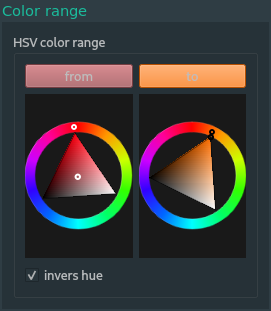

   4\.2 If you have the mask enabled and perform, you can verify the areas, which would be detected by the range. 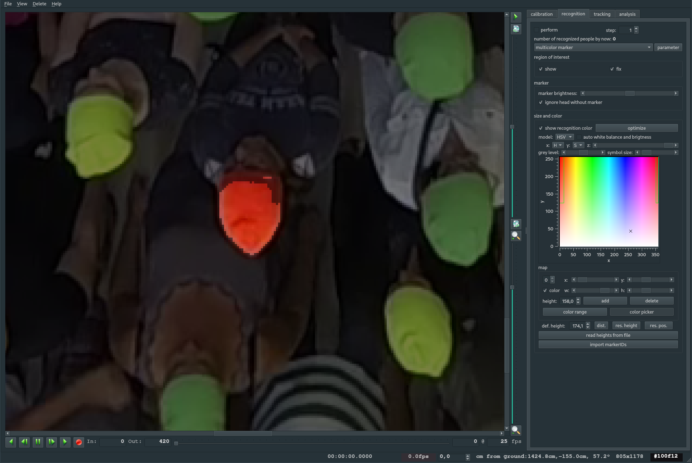

   4\.3 Make sure that most of the head are detected, and at the same time as few as possible pixels on the ground, walls, etc. To check if the wanted participants are detected you can also activate the recognition by checking the `perform` box. 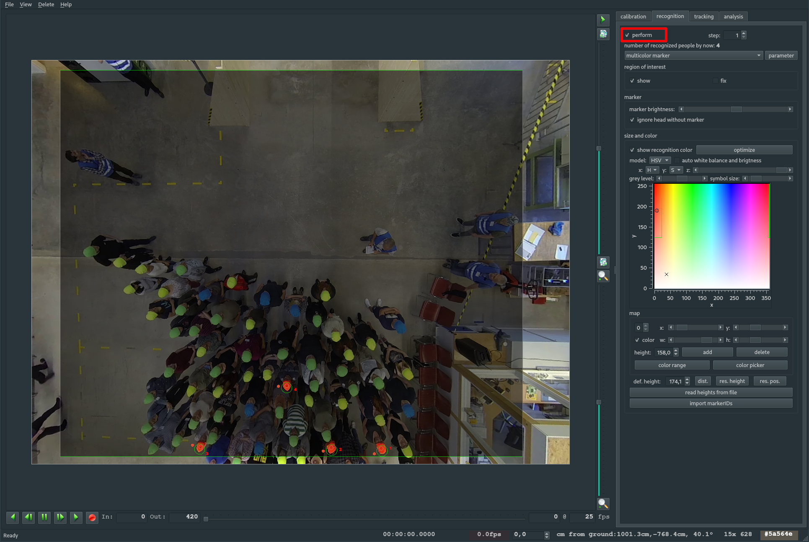

   4\.4 Enter the height, which should be used for the participants with that particular hat color. 

   4\.5 If you want to use an additional color, click on `add` and repeat the steps. 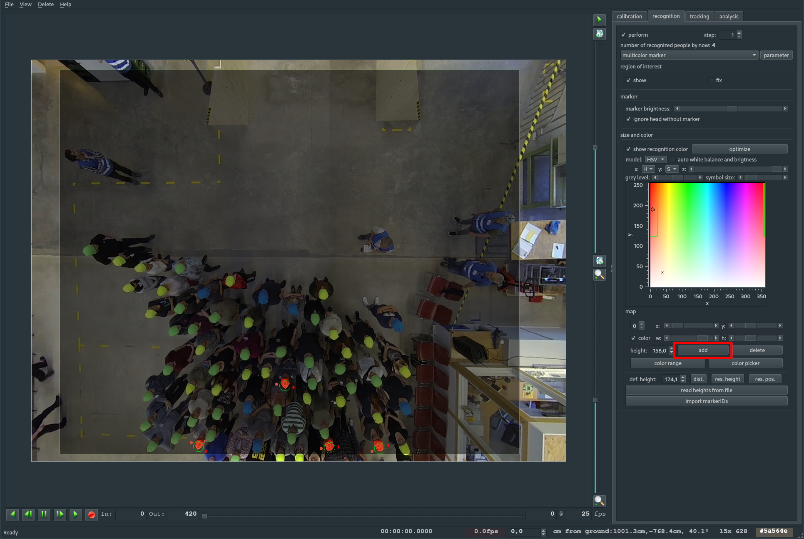
5. After all groups have been added, and performing the recognition, all participants should get recognized (with deactivated mask).

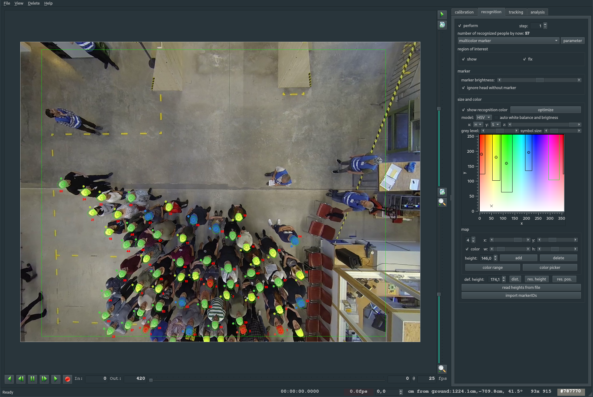

_`demo/02_recognition/04_recognition.pet` is the resulting PeTrack project files after these steps._

### Tracking

The next step to complete setting up a PeTrack project, is to set up the tracking. This is important for the parts where the hat can not be detected, then the current position is determined by the optical flow.

#### Setting ROI (region of interest) for tracking

Similar to the recognition tab, also in the tracking tab a region of interest can be defined. It will be depicted by blue lines and can also be fixed, to be immutable. Make sure that the tracking ROI is at least as large as the recognition ROI. Otherwise, if recognition happens without tracking, every single recognition/point starts its own trajectory.

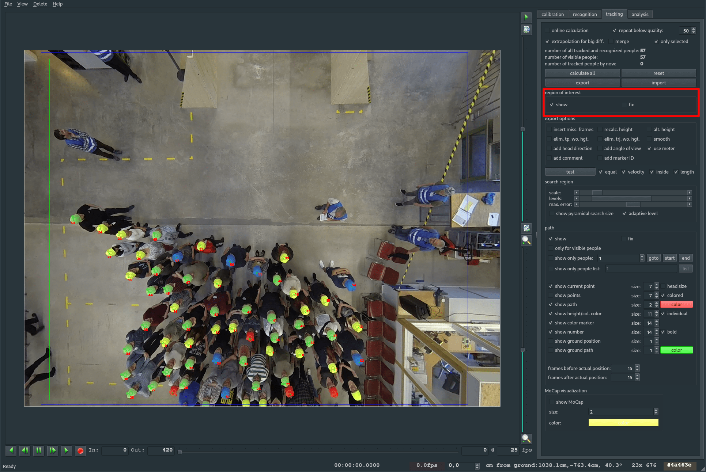

#### Running the tracking

When the ROI is set up, you have two options to track the pedestrians in the video.

1. `calculate all` (red rectangle): runs the tracking forward and backwards over the complete video.
2. `online calculation` (green rectangle): interactively navigate through the video (play, pause, backwards)

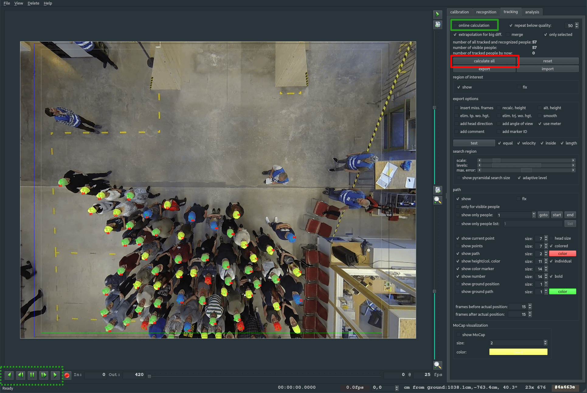

During the tracking you can see the current state, it should look similar to: 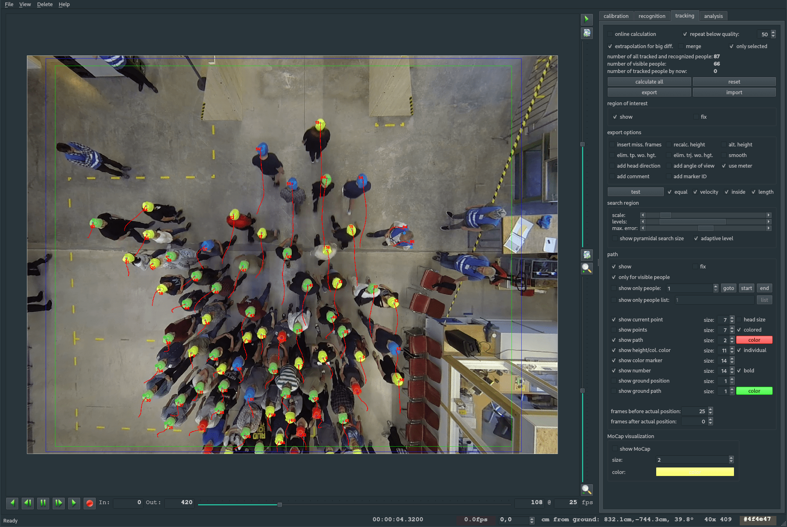

To see the trajectory line, you can fix how many frames before and after the current one should be included. 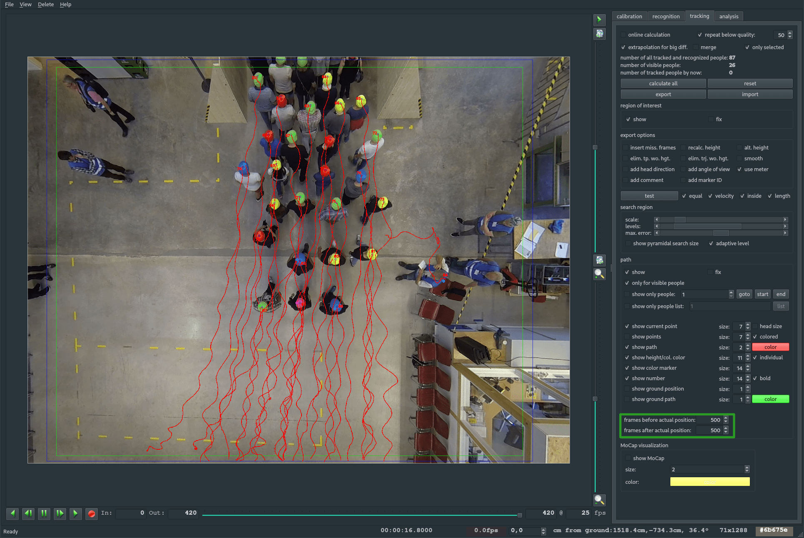

#### Export the result

When the tracking is completed make sure to export the resulting trajectories. Select the options which you want to have in your trajectory file. If you do not specify an extension, PeTrack will save both, the `trc` and `txt` trajectory files. In the `trc` file, the pixel values will be saved, and in the `txt` the real world coordinates are saved.

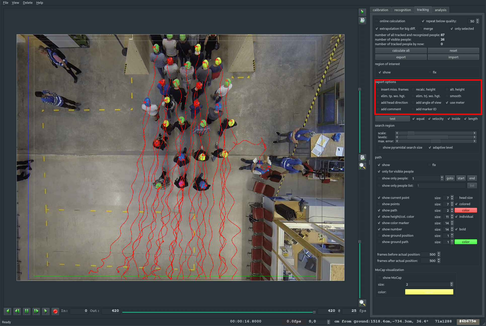

### Corrections

After the tracking is completed you are almost done. Now the trajectories may need some corrections, as some unwanted persons/artifacts got tracked. Or the track point clipped to an edge or moved to a different person. To investigate a single trajectory or a group of trajectories, the trajectories can be filtered, as can be seen in the green rectangle.

**Note:** At this point it is important to turn off the recognition to avoid getting extra persons.

**Note:** Make sure to export the trajectories, again after you made some changes. Only this way you avoid data loss, as currently no undo function is available in PeTrack.

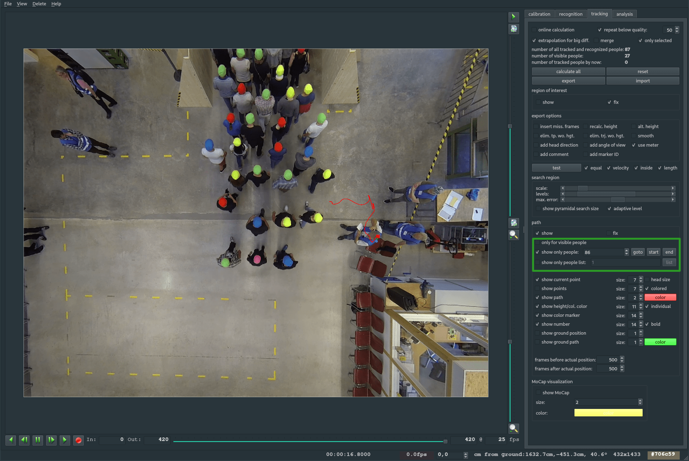

#### Run plausibility checks

A starting point to find possible faulty pedestrians are the plausibility checks. You can run them if you click on test. They will report different possible errors and automatically

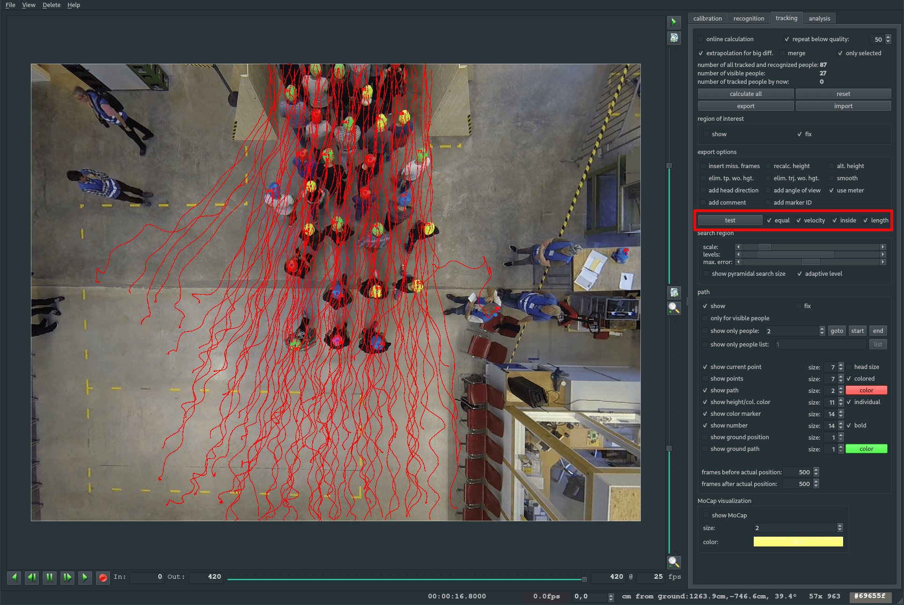

#### Remove unwanted trajectories

The easiest correction might be to remove unwanted trajectories. As it happens in the test, there is such a trajectory. The conductor got tracked, but we do not want his trajectory. So right click on the current point of the trajectory and select `delete whole trajectory`.


#### Smooth shaky trajectories

This is example is quite a nitpick. But the same effect might happen more exaggerated in real scenarios. As you can see here, the trajectory is not very smooth.

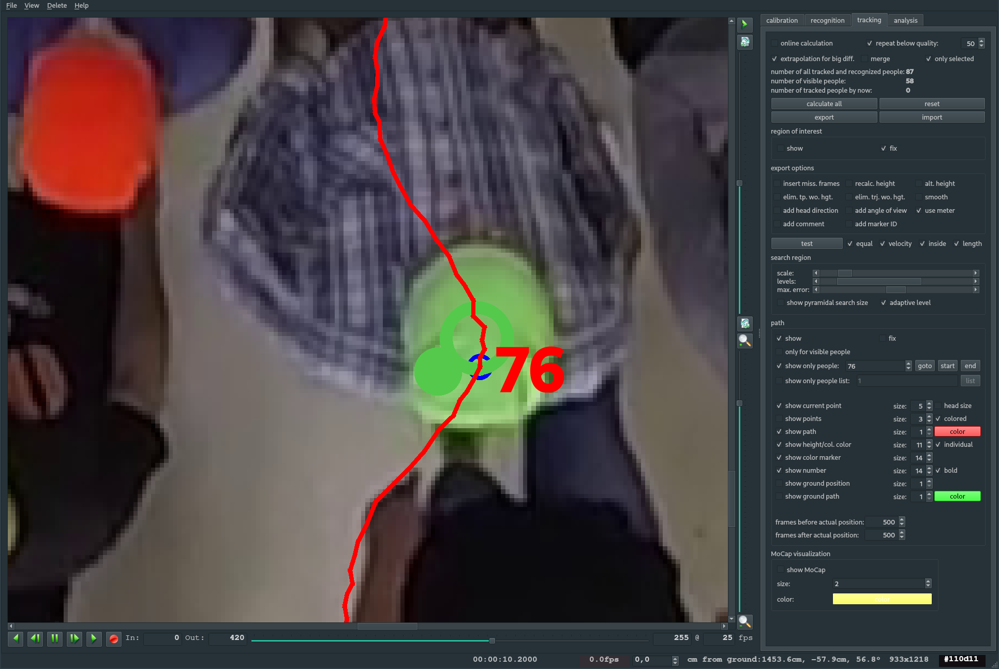

When you move through the trajectory frame wise you can move a track point by `⌃ Ctrl/⌘ Cmd`+`double left click`. If the track point does not move, you may have to add some intermediate steps as the movement was too large. After you smoothed out the movement, it may look like this.

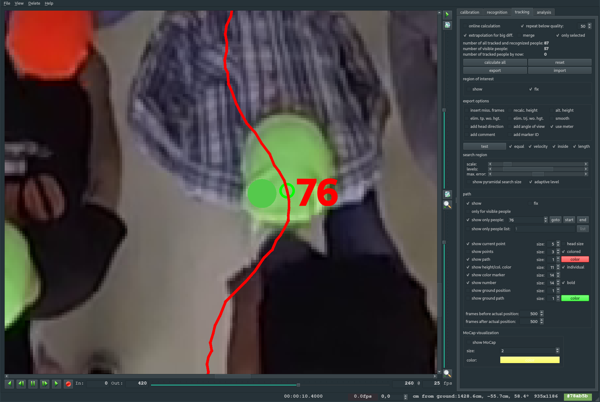

It is also possible to drag a track point directly into the desired position by holding `⎇ Alt/⌥ Option` and holding the left mouse button.

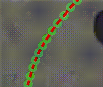

### Command-line options

If the trajectories of multiple experiments with the same setup are to be exported with PeTrack, it might be easier to use the command line interface. After the setup for one experiment is done, it can be used as a template for the remaining experiments, where only the video file changes. Thus, enabling a automation of the exporting process.

To reduce the manual input when projects are started automatically PeTrack supports some command-line options which are listed below:

```
petrack [-help|-?] [[-project] project.pet] 
          [-sequence imagesequenceOrVideo]
          [-autoSave|-autosave imgFldOrVideo|proj.pet|trackerFile]
          [-autoTrack|-autotrack trackerFile]
          [-autoReadMarkerID|-autoreadmarkerid markerIdFile]
          [-autoReadHeight|-autoreadheight heightFile]
          [-autoPlay|-autoplay trackerFile]
          [-autoExportView|-autoexportview outputFile]
-help|-?
shows help information for command line options
-project
optional option to set project file; otherwise the argument without option flag is used as project file
-sequence imagesequenceOrVideo
loads image sequence or video; option overwrites SRC attribute in project file
-autoSave|-autosave imgFldOrVideo|proj.pet|trackerFile
if the argument ends with pet, a project file will be written to proj.pet at the end; if the argument ends with txt,dat or trav, the trajectories will be written in a format according to the suffix of trackerFile; otherwise imgFldOrVideo is the folder to store the image sequence or a name of a video file for the direct export; in all cases PeTrack ends after finishing the work
-autoTrack|-autotrack trackerFile
calculates automatically the trajectories of marked pedestrians and stores the result to trackerFile
-autoReadMarkerID|-autoreadmarkerid markerFile
automatically reads the txt-file including personID and markerID and applies the markerIDs to the corresponding person. If -autoTrack is not used, saving trackerFiles using -autoSaveTracker is recommended.
-autoReadHeight|-autoreadheight heightFile
automatically reads the trackerFile including markerID and individual height and applies the heights to the corresponding person
-autoPlay|-autoplay trackerFile
plays the video or image sequence and stores the trajectories to trackerFile
-autoExportView|-autoexportview outputFile
exports the view, e.g., the undistorted video or the video with trajectories, to outputFile
Example:
To generate trajectories from a single image sequence starting with frame000.jpgwith settings stored in the project file project.pet, export tracker file trackerFileand exit with saving the project to project.pet again:
petrack.exe -project project.pet -sequence frame000.jpg
          -autoTrack trackerFile -autoSave project.pet
```