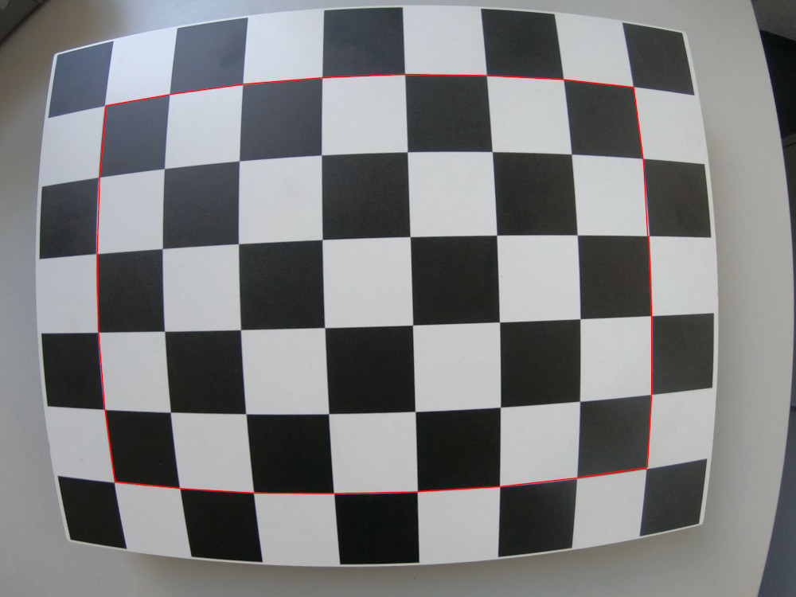
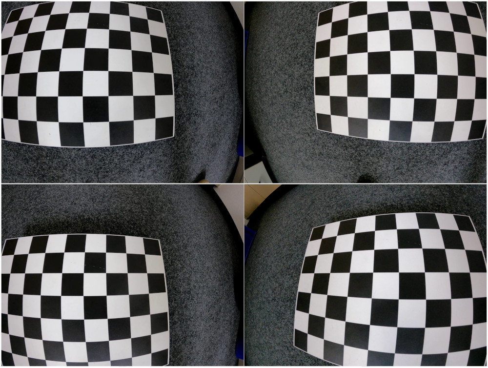
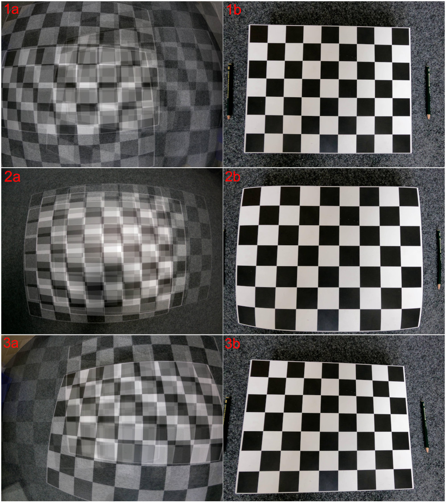
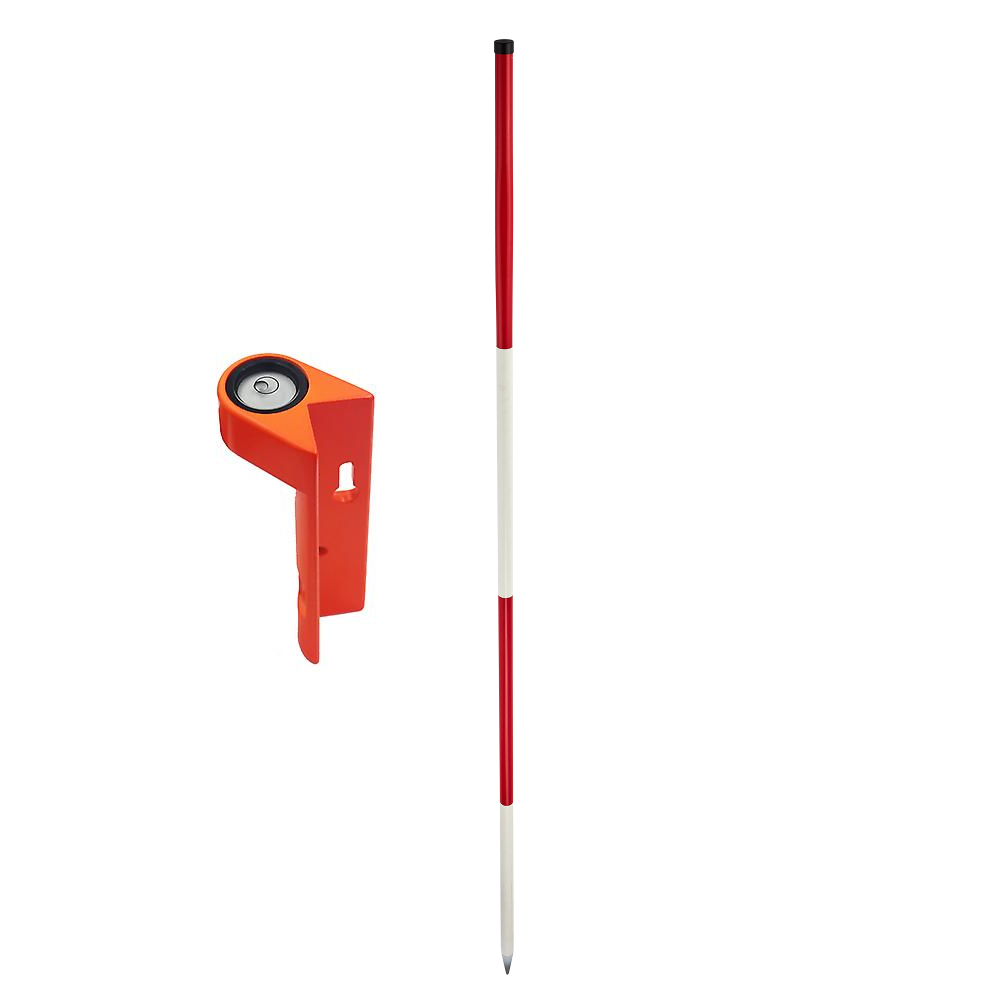
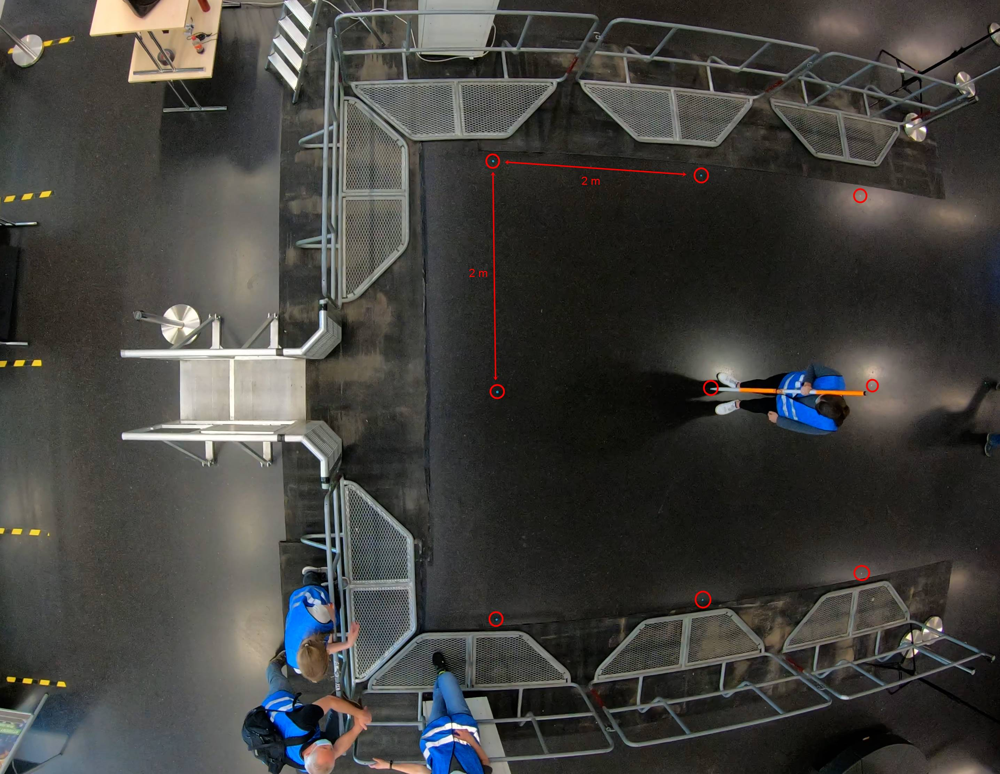

# Performing the Intrinsic and Extrinsic Calibration

## Intrinsic Calibration

### Preparation

To perform the intrinsic calibration you first need to prepare your [cameras](/planning/camera.md) and gather your tools.
Only when your camera settings for your experiment have been finalized you can perform the intrinsic calibration.

Regarding tools, we recommend to use a [chessboard pattern](https://jugit.fz-juelich.de/ped-dyn-emp/petrack/-/wikis/uploads/79770f9bbf41b6bebe9aeabfa5e10e05/pattern.pdf)
for the calibration, print it and fixate it on e.g. such a [sturdy surface](https://en.wikipedia.org/wiki/Sandwich_panel).
 
:::{Note}
The pattern should be completely flat and without wrinkles for the calibration so printing it on a piece of paper will not
be sufficient!
:::

### Performance

When performing the calibration it is good to know that only the area starting from the second row to the outer edge of 
the chessboard is being used for the calculation (Figure 1).

:::{figure-md} chessboard_border

Figure 1: Only the area inside the red rectangle will later be used for the calculation of the intrinsic calibration.
:::

Now record a short video of the chessboard pattern while trying to bring the area later used for calculation (Figure 1)
as close as possible to the edges of your camera view. Move **slowly** over the chessboard and cover one side after another
until the pattern has in total covered the entire view (Figure 2).

:::{figure-md} chessboard_coverage

Figure 2: Screenshots from a calibration video focusing of specific areas of the camera view. In total the cover the entire
view. From top left to right bottom the focus lies on the following area of the view: top left, top right, bottom left, bottom right.
:::

The reason to cover the entire camera view is that the calibration will only be applied to the covered area. If only the
center is covered, the center will be well calibrated but the border region will not!
Additionally, try to select an equal number of images overing each side of the camera view, so the calibration will be
applied to the entire view equally. You can find examples of calibration images covering the entire view, only the center
and heavily the right side of the view in Figure 3.

:::{figure-md} calibration_examples

Figure 3: 1a: Overlay of calibration images covering entire view, 1b: Good overall calibration result; 2a: Overlay of
calibration images covering only the center, 2b: Good calibration result in the center, poor result around the border;
3a: Overlay of calibration images covering heavily the right side, 3b: Good calibration result on the right side,
poor quality on the left side of the image.
:::

:::{Tip}
Since it is best to take the calibration video on scene at the experiments, take your time while recording the video.
Move extra slow and even move the area used for calculation out of the camera view. When taking images out of the video
you will be able to select the perfect moment in time when the pattern is closest to the border.
:::

## Extrinsic Calibration

###  Preparation

In addition to the intrinsic calibration, an extrinsic calibration must also be performed on scene. For this we recommend
using a sturdy pole e.g. a ranging pole with a level attached to it (Figure 4). Additionally, a cross laser, measuring
rods and adhesive points can be of great help.

:::{figure-md} ranging_pole_level

Figure 4: Example of a ranging pole and a level that can be attached to the pole.
:::

::: {Tip}
The pole should be about 2 meters tall to still be close to the head height of pedestrians while at the same time ensuring
that the person performing the calibration does not accidentally cover the top of the pole.
:::

Before performing the calibration you should decide on a calibration grid that will be used for the calibration. This
grid should be spread over the experimental area and should be prepared by e.g. putting adhesive points on known points
on the ground. Hereby it is important to place the points very accurately because even small deviation can cause a big error
over the large distance of the experimental area. You can view an example of a 2 meter by 2 meter coordinate grid in Figure 5.

:::{figure-md} coordinate_grid

Figure 5: Example of a 2m x 2m coordinate grid. Each put coordinate point is encircled in red.
:::

:::{Note}
Your coordinate grid should have a size that fits the experimental setup. A second option is to measure out objects that
are in your experimental area and use them as your coordinate points. However, sometimes it gets tricky to have them 
cover the entire experimental area and not only the edges.
:::
 
Create a sketch of your coordinate grid including measurements. Also note down the time at which you are starting the
extrinsic calibration. This will help you to locate the calibration, especially in longer video recordings.

### Performance

The aim of the coordinate grid is to log known 3D points in the experimental setup. There are already known 2D points through the
adhesive points on the ground and by placing the ranging pole (of known height) on the points, we can add points from the third dimension.
Use the level that is attached to the pole to check the alignment. When you are happy with the alignment, make e.g. a rapid
movement with the pole. Later when taking images from the video, you can identify the point in time when the pole was 
perfectly aligned by navigating to the last frame before the rapid movement with the pole.
 
Walk through your coordinate grid and log each calibration point to perform the extrinsic calibration.

:::{Tip}
While performing the calibration, make sure to not stand in between the pole and the camera.
This will help you to avoid blocking the view to the point on the ground with your feet or the top of the pole with your head.
:::

