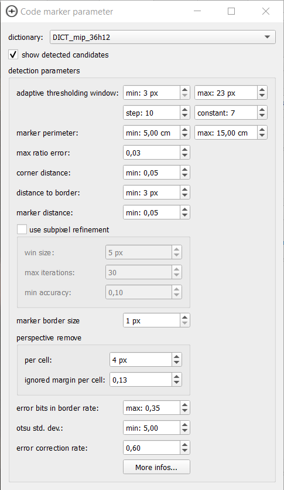
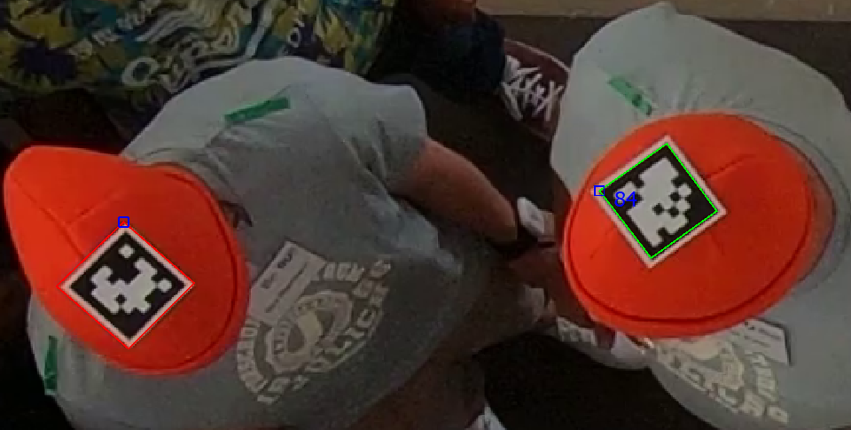

# Code Marker

The code marker is an aruco marker, a special fiducial tag. This means that not only is the marker designed to be easy and robust to detect, it also contains a code number. Therefore the code marker enables an association of trajectories with other data, e.g. questionnaires. However, the code marker needs a comparatively high resolution. We recommend at least 8 pixels per bit of the code.

## Marker Options

The options for the code marker are entirely contained within the parameter dialog of the marker.

:::{figure-md} aruco-options

The option dialog for the code marker.
:::

The code marker has a lot of options and it is beyond the scope of this documentation to explain all of them. We refer to the [documentation of OpenCV](https://docs.opencv.org/4.5.3/d1/dcd/structcv_1_1aruco_1_1DetectorParameters.html#details) for a more detailed explanation of the parameters (also accessible via the `more infos...` button in the parameter dialog). 

:::{tip}
In our experience the `adaptive thresholding window` parameters are very influential
:::

:::{important}
Select the correct dictionary! It needs to match the dictionary used to print out the codes.
:::

The only option that is unique to PeTrack is `show detected candidates`. When this checkbox is enabled, all candidates are drawn onto the screen. 

:::{figure-md} aruco-candidates

Visualization of code marker candidates. Successful detections are green, mark the upper left corner and show the id of the marker. Candidates which did not result in a detection, because of an unreadable code, are shown in red. Accordingly, without id.
:::

## Extra export options

The usage of the code marker enables two new export options to be enabled:

- `add marker id`  
  Adds the id of the detected code marker to the txt export
- `add head direction`  
  The code marker has a fixed orientation. Therefore, its orientation can be detected and exported. If care is given that the orientation of the marker aligns with the orientation of the pedestrian head, this is a measurement of the head view direction.