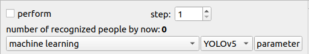

# Machine Learning Marker

The machine learning marker uses neural networks to detect the pedestrians. Therefore, the type of pedestrians that are detected depends on what the machine learning model was trained on. 
To keep it flexible, the user has to provide a model himself. For example, if he provides a model that was only trained on people wearing colored hats, then only pedestrians with colored hats are detected.
For a general purpose, you can find a model that was trained on many different experiments on our data archive. (TODO: Link einfügen)

## Selecting the model version
:::{figure-md} model-version-selection

Model version selection
:::

After selecting machine learning as your preferred method for recognition, you have to choose which pretrained model your model is based on.
Currently supported are YOLOv5 and YOLOv8.

## Machine learning parameter window
:::{figure-md} machine-learning-parameter-window

Machine learning parameter window
:::

The parameter window lets you upload your custom model and tune various parameters to ensure optimal performance.

confidence threshold
: The model provides a value for each detection describing how confident it is in its prediction. 
The confidence threshold determines how confident the model has to be in its prediction for it to be accepted as a valid detection.

NMS threshold
: NMS (Non-Maximum Suppression) is a method to prevent multiple detections of the same object. It measures how much overlap there is between two detections.
If it overlaps more than the specified threshold, then the detection with the lower confidence value is discarded.

score threshold
: Besides a confidence value, the model also provides a value on how certain it is that a given detection belongs to a certain class.
The score threshold determines how high this value has to be for a detection to be accepted. When using the default model
there is only one class (Pedestrian), so this option has no effect. It is only useful when you differentiate between multiple classes of pedestrians.

image width
: The image width refers to the image size used when **training** the model. When you use the default model, 640 is already the correct value.

model
: Here you can upload your preferred model for recognition. The default model can be found here. (TODO: Link einfügen)
The model has to be in the `.onnx` format and either be trained on YOLOv5 or YOLOv8.

class names
: Here you can upload a `.names` file that lists all the used classes line by line, if you have more than one. When using the default model,
you don't have to upload anything, and `Pedestrian` is used as the only class.
