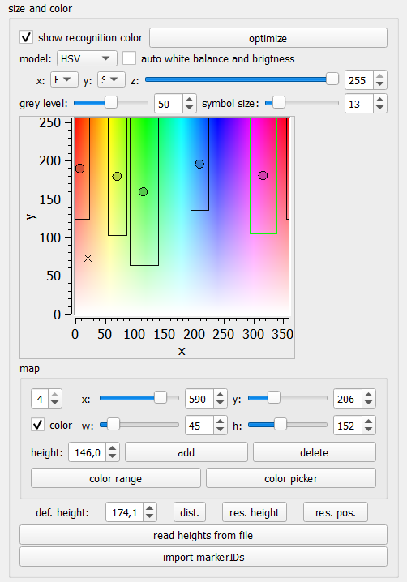

# Multicolor Marker

The multicolor marker is a colored hat that pedestrians wear. For a quick rundown on when to use which type of marker, see **TODO ref to Maiks section**. But in a nutshell, the multicolor marker is easy to prepare and works even with low resolution cameras. It can be combined with an code-marker as well, if some cameras are high-resolution and some are not. Then, low-resolution cams fall back to the multicolor marker in case the code cannot be read.

There are two places for settings parameters of the multicolor marker. The parameter window as well as the recognition tab.

## Multicolor Parameter Window

:::{figure-md} multicolor-param-win

Parameter window of the multicolor marker
:::

In the parameter window, we have a plethora of options:

The first options concern themselves with combinations of the multicolor marker with other markers, namely the hermes marker and code marker. When the multicolor marker is combined with another marker, first the multicolor detection is run. Afterwards, on the area around the detected head, the other marker is searched. The idea is to combine the robust, but slightly inaccurate multicolor marker with a more accurate and "structured" marker.

use black dot
: The multicolor marker can be used with a black dot added, essentially creating a combination between the hermes marker and the multicolor marker. **TODO: add picture** This gives a bit more structure for tracking and a smaller specific point in the image to locate. If one does use this, this checkbox should be enabled and the size set to the size of the point in cm. Else, this option can be turned off.

use code marker
: The multicolor marker can be combined with the [code marker](aruco), which is called code marker here. A click onto the `parameter`-button opens the parameter window for the code marker. There the options for the detection of the code marker can be changed. Please refer to the [documentation of the code marker](aruco) for further information on this.

The following three options are all for combinations with either the hermes or the code marker

ignore head without black dot or code marker
: If this is enabled, all detections where only the colored hat, without the extra feature, was detected will be discarded. If this is not checked, detections on color only are used as well. If e.g. the code cannot always be recognized due to the camera resolution, this should be off. However, in case the extra feature should be recognizable, this could reduce false positives or at least mediocre detections.

use color marker for big error
: If both, the color point and the feature point (black dot, code marker) are detected and subsequent tracking of the feature point has a high error, enabling this options lets PeTrack redo the tracking, using the color point instead of the feature point.

restrict position of black dot
: When this option is enabled, the black dot is searched in a smaller area, determined by the expected position of the dot given the angle at which the camera looks at the pedestrian.

From here on, the other options refer to the color marker itself.

auto correct perspective view
: The multicolor marker always takes the point in the middle of the colored blob in the image. However, since the camera looks at the pedestrian from a certain angle, this is not the same as the middle of the head. Enabling this option activates a correction for this error.

only for export
: Activating this option means, the correction for perspective view is during the export and not during tracking and recognition.

:::{note}
If you enable `auto correct perspective view`, it is recommended to also enable `only for export`. Otherwise the correction of the perspective view during tracking can lead to the point going to the edge of the visible head, worsening tracking performance.
:::

show mask
: When enabled, we show a mask visualizing the color selection **TODO: true, what about the other mask?**

close radius
: Closing is a morphological operation to remove small holes. A larger value means, larger holes will be filled. The filter is only applied if `use` is checked.

open radius
: Opening is a morphological operation to remove small dots or specks. The larger the value, the larger the specks which are removed. The filter is only applied if `use` is checked.

The head detection detects blobs of a certain color. It then filters out some of these blobs on a variety of criteria. Here are some options on those:

area
: This is the minimum and maximum area in pixels a head is allowed to have. Each blob that has fewer pixels than the minimum or more pixels than the maximum does not count as a detection. When `head size` is checked, PeTrack tries to determine sensible values from the camera position and average head size of pedestrians.

max ratio
: This is the maximum ration between the long and short semi-axis of the ellipse fitting to the blob. If the ratio is larger, the detection is discarded. This filters out very long very thin blobs.

Finally, another option on color mask selection

opacity
: This sets the opacity of the mask which shows the current color selection. If `mask` is checked, the selected parts of the mask are translucent. Otherwise, they are white.

## Color Selection

:::{figure-md} color-selection

Part of recognition tab for color and height selection
:::

The second part of the settings for the multicolor marker are part of the recognition tab. There we can see the color selection. PeTrack uses the color to encode the height of pedestrians. By giving pedestrians of similar height the same hat color and encoding the average height per group in this color, the accuracy of the coordinates can be enhanced. Especially if the height of the pedestrians has large variations (e.g. kids and adults, or adults and wheel-chair users).

The mappings from color to height are called `map` in PeTrack. This mapping is used for multiple markers, including e.g. the casern marker. Therefore, some of the options here are not relevant for us.

:::{figure-md} color-plot

Color Plot: The rectangles are color regions corresponding to a certain color map. The circles are colors corresponding to a detected point. The `X` shows where the color of the pixel under the cursor lies in the plot.
:::

The most eye-catching element of this part of the UI is the [color plot](#color-plot). This plots visualizes the existing maps as well as the colors of existing detections and of the pixel under the cursor. The visualization of the colors of the detections can be disabled with the checkbox at the top of the `size and color` area titled `show recognition color`.

One quickly realizes that all detections lie directly in the middle of their respective map. This is by design. The multicolor marker searches e.g. for an orange hat. When it finds such a hat, it just assigns it the color orange. Therefore, all detections from the same map have the same color. This is not the case if you use an older marker, like the casern marker. There, the color needed to be sampled from the image. The `optimize` button includes some functionality to improve this sampling by removing outliers. Accordingly, it has no functionality for multicolor markers.

The other options above the color plot are for changing its visualization. However, the multicolor marker has other visualization means, which are better suited. So no more detail for these options are given.

:::{figure-md} maps-section

The maps section of the recognition tab
:::

Below the color plot, we see the maps. We see the currently selected map (1 in the [figure](#maps-section)) and the corresponding height (2 in the [figure](#maps-section)). We can change both, what map is selected and what height we want to assign to this map. If we want to add or delete maps, we need to use the according button (3 and 4 in the [figure](#maps-section)).

The different sliders are for an old way of color selection. They are not suited for multicolor markers and can safely be ignored. Similarly, the `color` checkbox can be ignored. Instead, we use **either** the `color range` or the `color picker` button to select a color for the multicolor marker (5 and 6 in the [figure](#maps-section)).

:::{note}
`color picker` and `color range` do not play well together. That is, a color obtained with one cannot be fine tuned with the other.
:::

Some general remarks hold for either method:

:::{tip}
Deactivate `open` and `close` while selecting a color. First try to select the color best you can and then activate the options to improve upon this selection. Using them while selecting the color means you are optimizing 3 parameters at once.
:::

:::{tip}
Activate the `mask` from the multicolor parameters and set the opacity to ca. 50%. This enables you to see how well your color selection works (see screenshots later)
:::

:::{note}
You need to activate `perform` for the color mask to update!
:::

### Color Picker

When pressing the `color picker` button, the color picker modus is activated. In this modus, one can `shift + left mouse click` on a pixel to start a color selection and then expand this selection with a normal `left click`. 

:::{figure-md}

Example usage of color picker. With the mask enabled and `perform` checked, we can interactively select the color, looking at different parts of the image to find still uncovered parts. Note that colors which are "close" to each other may not be easy to differentiate with the color picker (here green and yellow). Then the `color range` dialog might be a better option
:::

### Color Range

When you click on `color range`, a color selection dialog appears:

:::{figure-md} color-range-dialog

Color range dialog: The dialogue allows selecting the lower bound and upper bound color via an hsv color picker. 
:::

The color detection works in the HSV (Hue, Saturation, Value) color space. Hue is the "color", i.e. redness or greenness of the color. Saturation how saturated it is. And value, how bright it is. The dialog allows you to select to colors from this space. All colors that lie "in between" your selected colors are then part of your selection. It is noteworthy that the hue part is a value in degrees from 0° to 360°, with red being around zero degree. To allow the selection of red-ish colors as well, there is an option `inverse hue`, which changes the direction of this difference. That is we select colors with hue $h$ such that $h_{min} < h < h_{max}$ if `inverse hue` is not selected and colors with $h < h_{min} \lor h > h_{max}$ if `inverse hue` is selected.

:::{figure-md} color-range-example

Example usage of color range dialog. With the mask enabled and perform
activated, one can interactively see which colors in the frame are selected and
which are not.
:::

