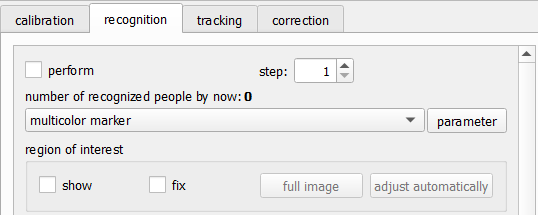
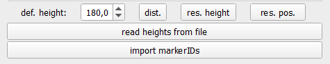

# Set Up Recognition


## General Settings

:::{figure-md} general-settings-reco


The general settings at the top of the recognition tab
:::

At the top of the recognition tab, you can find the [general settings](#general-settings-reco) of recognition:

perform
: When checked, this enables the automatic recognition of pedestrians

step
: This number decides on which frames to run the detection, i.e. if step is set to 2, only every second frame a detection of pedestrians is done. The gaps are filled with tracking.

marker
: Where the image shows "multicolor marker", we can select the specific marker we want to use

parameter
: The button parameter opens a pop-up window where we can set the parameters of the selected marker

The `step`-option exists, because recognition is more computationally expensive than tracking. On modern computers this should not be a problem. Since recognition is more accurate than tracking, a step of 1 is recommended, i.e. running recognition on every frame.

## Region Of Interest

The region of interest (ROI) is the part of the image where a detection is
performed. For the ROI we see the options

show
: Shows the ROI as a green rectangle on the image

fix
: "Fixes" the rectangle, such that it cannot be moved with the mouse

full image
: Sets the ROI to the full image

adjust automatically
: Sets the ROI as one head size smaller than the tracking ROI

The ROI can be adjusted in the image, by resizing and moving with the mouse.

:::{warning}
The tracking ROI must be larger than the recognition ROI. Any detection outside the tracking ROI will create an entirely new, one point trajectory. We recommend setting the tracking ROI first and then using `adjust automatically` for the recognition ROI
:::

## Height-based Options

At the bottom of the recognition tab there are a few options regarding the height of pedestrians.

:::{figure-md} height-options


Height options at the bottom of the recognition tab
:::

def. height
: This is the default height. It is used when a pedestrian does not get a height by other means (i.e. from their marker) and for some calculations where the height of a pedestrian is not known already. Ideally, this is set to the average height of pedestrians in your experiment.

dist.
: prints the height distribution to the console (currently **only works with multicolor marker**)

  ```
  [colorPlot.cpp:683:ColorPlot::printDistribution][info] height: 146.00 - number   1 (1.14%)
  [colorPlot.cpp:683:ColorPlot::printDistribution][info] height: 158.00 - number   9 (10.23%)
  [colorPlot.cpp:683:ColorPlot::printDistribution][info] height: 168.00 - number  31 (35.23%)
  [colorPlot.cpp:683:ColorPlot::printDistribution][info] height: 179.00 - number  39 (44.32%)
  [colorPlot.cpp:683:ColorPlot::printDistribution][info] height: 192.00 - number   8 (9.09%)
  ```

res. height
: Resets the height of all pedestrians that was obtained through either a stereo camera or marker ids

res. pos.
: Resets the position of all points calculated via a stereo camera

read heights from file
: This button enables you to load a file with the following format. This file assigns a height to each marker id (that is the id from the code marker). That individual height is more accurate than an average height assigned via the color of a hat.

  ```
  # id z/cm
  987 184
  988 179
  993 175.5
  ```

import markerIDs
: This button enables you to load a file to assign a marker id (or code id) to a pedestrian with a given PeTrack-internal id. That can be used if a few people in the video have a code marker which is never recognized, but they can be identified by the experimenter visually.

  ```
  # id markerID
  1 995
  2 999
  3 998
  ```