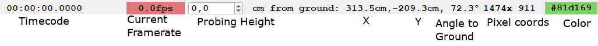
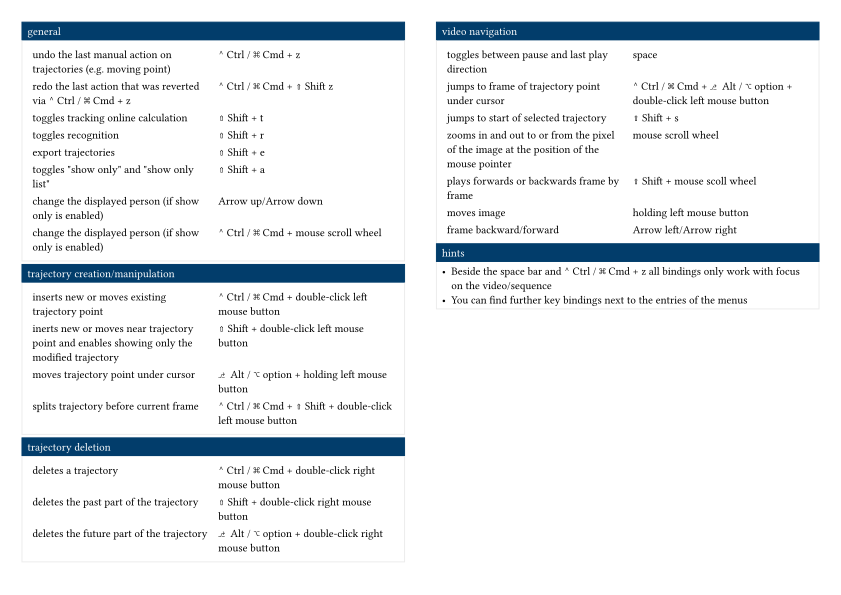

# User Interface

:::{figure-md} ui-annotated


PeTrack after opening without project
:::

:::{figure-md} ui-with-vid


PeTrack after opening a video file
:::

PeTrack's UI is made out of a few parts.

## Video View and Video Side Bar

The video view is where the video and possibly visualizations on top of the video are displayed. One can zoom in via the scroll wheel or the lower half of the video side bar. When using the scroll wheel, one scrolls towards the pixel under the mouse cursor. If only parts of the image remain visible due to zooming in, one can navigate in the image by pressing down the left mouse button inside the image and dragging it. One can fit the entire image in view with `Ctrl + 0` or under `View > Fit in window`. Alternatively, one can fit the recognition region of interest to the view with `Ctrl + 1` or `View > Fit in region of interest`.

Furthermore, one can rotate the image using the upper half of the video side bar.

## Player Control

The player control has the following buttons from left to right:

:::{image} images/PlayerControl.png
:::

play backwards
: This button starts a backward playback of the video. 

:::{note}
Backward playback is *a lot* slower than forward playback, because video codecs are optimized for forward playback.
:::

single frame backward
: This button jumps one frame backwards

pause
: Pauses the video

single frame forward
: This button jumps one single frame forward

play
: Plays the video (forward direction)

record
: This button starts a recording. 

:::{note}
We recommend using the `Export Video` or `Export Video View` options from the `File` menu in the menu bar instead of the recording button.
:::

Next to these buttons are the boxes labeled `In` and `Out`. If the video is longer than the experiment, one can use these to specify a different starting frame (`In`) or ending frame (`Out`) for PeTrack. PeTrack then treats the video as if all frames before `In` and after `Out` do not exist. The default values are 0 for `In` and the last frame of the video file for `Out`.

Then there is a slider which can be used to scrub through the video.

Last on the line are two boxes `_ @ _ fps`. The first of these boxes shows the current frame and the last shows the framerate at which PeTrack tries to play the video. Both values can be edited by the user, either to jump to a certain frame by changing the current frame or to change the playback speed by changing the fps.

:::{note}
For changing the fps relative to the original speed, there are options under `View > Playback speed`. The desired playback speed only changes the behavior of PeTrack if `Fix playback speed` or `Limit playback speed` are selected (both under the `View` menu).
`Fix playback speed` plays at the desired speed, skipping frames if necessary. `Limit playback speed` only ever slows down a video, never skips frames to speed it up.
:::


## Tab View

The tab view is where most settings can be set. Its content depends on the tab selected and is described in the documentation using these. The widths of the tab view can be changed by dragging the border of the tab view with the mouse. With the green arrow in the video side bar, the tab view can be collapsed entirely as well.

## Status Bar

The status bar is mostly empty on an empty project, but once a video is loaded, one can see different data in it, see the following figure:

:::{figure-md}


The right side of the status bar shows a lot of information. All information
shown right from the current framerate is dependent on the current position of
the mouse cursor in the image.
:::

Timecode
: This part of the status bar displays the timecode corresponding to the current frame. Since the timecode is taken from the video file, this does not necessarily correspond to either the real world time nor does it need to start at zero. In stereo recordings, this can also show the time given by a time file.

Current Framerate
: This shows the framerate at which the player is currently playing. Note that there is some *intertia* to how fast this display updates. The color indicates whether we play slower than realtime (red) or at realtime or faster (green).

Probing Height
: The following data fields contain some information about the position of the pixel under the mouse cursor. Due to the perspective projection onto the camera, this information can only be given when assuming a certain height, i.e. the position of the pixel under the cursor is different, if the object under the cursor is 180cm or 150cm high. This box is for changing the height used for the next few fields

X, Y, Angle to Ground
: These fields show the x and y position of the pixel under the cursor under the assumption it has a height equal to the probing height. The angle to ground is the angle between the line from the camera to the point and the ground. An angle of 90° means the point is perpendicularly under the camera.

Color
: This shows the color of the pixel under the cursor

## Log-Window

Many helpful comments or error messages are shown in the log window (`View > Show log window`).
You can also save the log file from the log window.

## Menu Bar

The menu bar includes a plethora of menus. Feel free to explore the different options. Here only the basics are listed.

File
: Options to open or save projects; or export files (see [Export](/export/video.md))

Edit
: Some functionalities to edit the trajectories. Those are explained in the section [Possible operations for corrections](/correction/correction-workflow.md).

View
: Here you can set parameters like the playback speed of the video or the size of the video in the window. 

Help
: Here you find the `keybindings`. <!-- Link einfügen wenns irgendwann das richtige Unterkapitel dafür gibt -->

PeTrack (Mac)
: Here you find information about your current installation of PeTrack, e.g. the version. For Windows/Linux you can find this in `About` under `Help`

## Keybindings

The most up-to-date list of keybinding can be found in PeTrack itself under `Help > Key bindings`. Additionally, you can download our [cheat sheet](images/petrack-cheat-sheet.pdf) to print out.

:::{figure-md}


Cheat sheet for PeTrack. Download [here](images/petrack-cheat-sheet.pdf)
:::

```{toctree}
:hidden:
visualization
```