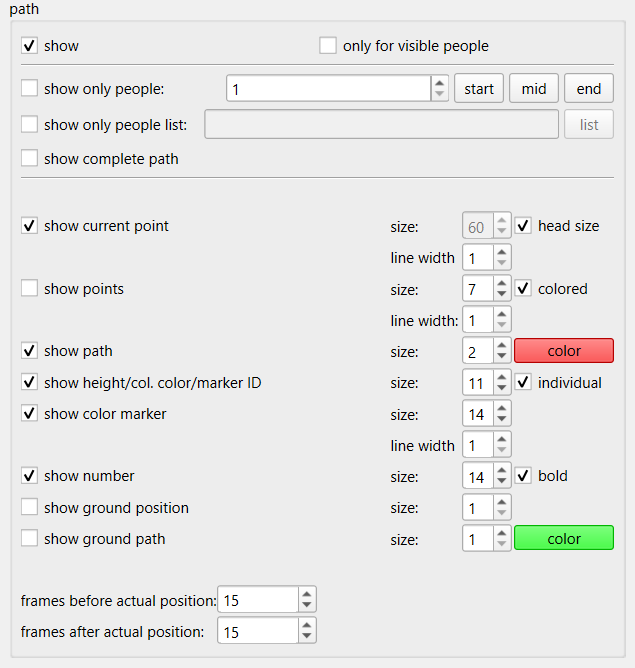

# Visualization of Points and Trajectories

Options for the visualization of points and trajectories are included in the tracking tab.

:::{tip}
If you want to use PeTrack visualizations in your publication export the view of PeTrack instead of taking a screenshot. This will result in a higher-quality image. See [here](../export/video.md#export) for more info.
:::

## Options

show
: Enables or disabled all of the following visualizations

### Trajectory visualizations

Trajectory visualizations are visualizations that show not only information about the current point, but also about the future and past trajectory.

frames before/after actual position
: These two spin-boxes allow to select how many frames into the future and past all different trajectory visualizations are supposed to draw.

  :::{image} images/frames_before_after.png
  :::

show path
: Shows the trajectory as a line. Note that during the first playback, only the past trajectory is drawn, since the future has not been tracked yet

  :::{image} images/past_path.png
    :width: 50%
  :::

  After tracking the whole video, the trajectory will be drawn in both, past and future directions

  :::{image} images/past_future_path.png
    :width: 50%
  :::

show ground path
: The head position can be projected down to the ground. This options draws the trajectory of this projection to the ground.
  :::{image} images/ground_path.png
    :width: 50%
  :::

show points
: Shows the detected points.

  :::{image} images/show_points_wo_color.png
    :width: 50%
  :::
  If the `colored` checkbox is checked, the color of the TrackPoint is used to fill it out

  :::{image} images/show_points_with_color.png
    :width: 50%
  :::

### Point visualizations

Point visualizations only visualize information about the currently displayed frame.

show current point
: Shows the point from the currently displayed frame. The line is colored green, if the point was created as the result of recognition or manually. It is colored blue if the point is the result of tracking only.

  Checking `head size` will set the size of the point heuristically to the avg. head size of a person.

  :::{image} images/current_point.png
    :width: 50%
  :::

show height/col. color/marker ID
: This option enables two different visualizations.  Note that `individual` does not do anything for the currently recommended markers.

  A colored blob, next to the person, showing which color is assigned to person.
  :::{image} images/show_color.png
    :width: 50%
  :::

  A marker ID from an aruco marker (note that a color blob is visualized as well here)
  :::{image} images/show_marker_id.png
    :width: 50%
  :::

show number
: Shows the PeTrack id of a person
  :::{image} images/show_number.png
    :width: 50%
  :::

show ground position
: Shows the projection of the head position to the ground

  :::{image} images/ground_projection.png
    :width: 50%
:::

### Show only

There are a few options which allow to select people for visualization and consequently disable visualization for all other pedestrians.

show only visible
: This option shows disables the visualization for all people that are not visible in the current frame. This way, the past trajectories of these pedestrians is not visible and does not clutter up the image. This option does not count as *selecting*, i.e. `show complete path` and `only selected` do not change their behavior due to this option.

  :::{image} images/only_visible_example.webp
    :width: 80%
  :::

select only people
: This spinbox allows to select a person by their PeTrack id. This person is then the only person visualized. If `only selected` is checked for tracking, only this person will get tracked as well.

  :::{warning}
  If `only selected` is not checked, all pedestrians are tracked, even though only one is visualized!
  :::

  The buttons next to the spinbox allow to jump to certain frames. `goto` jumps into the middle of the trajectory. `begin` jumps to the first frame of the trajectory and `end` jumps to the last frame of the trajectory.

show only people list
: Select multiple people. One can use a comma-separated list of id's or a range of id's written as e.g. `10-15`. Only the selected people are visualized anymore and if `only selected` is checked for tracking, only the selected people are tracked

  :::{image} images/show_only_people_list_widget.png
  :::
   

  :::{image} images/show_only_list_example.png
    :width: 80%
  :::

  :::{warning}
    If `only selected` is not checked, all pedestrians are tracked, even though only a few are visualized!
  :::

show complete path
: This option changes `show path` to show the complete path (i.e. *all* past and future frames), if and only if there is an active selection (i.e. `show only people` or `show only people list` is active). If there is no active selection, this option does nothing.

## Other Options

Here some information on visualization options which are mostly for old markers. Mostly for completeness sake. This section can be skipped for most people.

show color marker
: Helpful option for markers that include the color as extra point, e.g. the casern marker. The circle drawn by this is colored in the color that was detected and drawn around the colored portion of the marker.
  :::{image} images/casern_visualization.png
    :width: 50%
  :::

show height/col. color/marker ID
: The height part of this visualization is for stereo cameras, which can measure the height of a person directly. If ``individual`` is selected, two height values are shown. The height measured in the current frame and the avg. height of the all frames. If `individual` is not selected, only the avg. is shown.

  :::{image} images/show_height.png
    :width: 50%
  :::